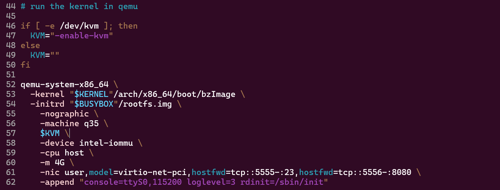
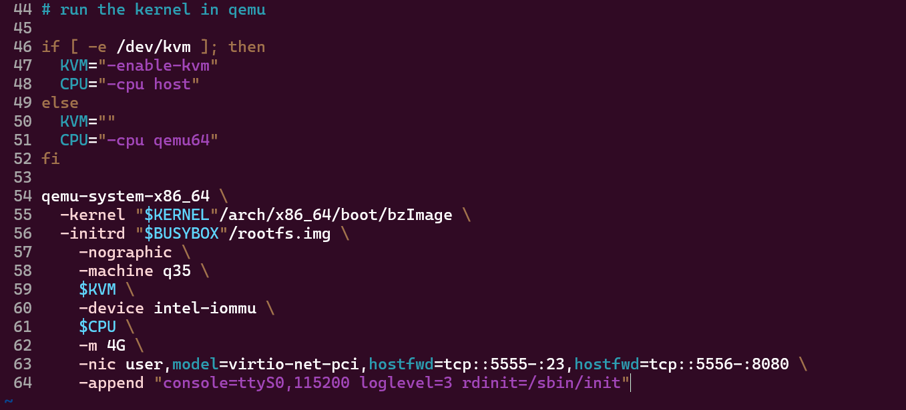
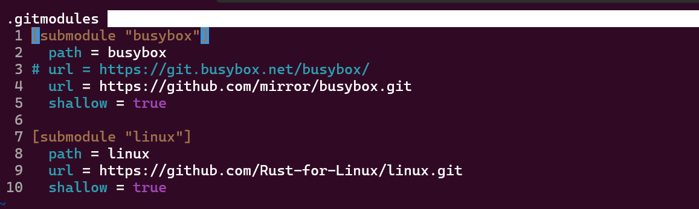
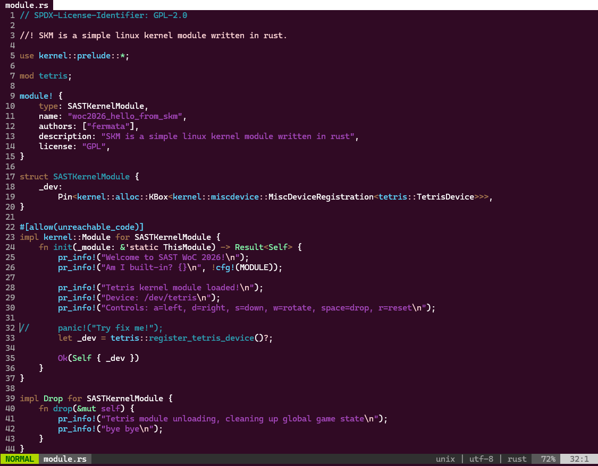
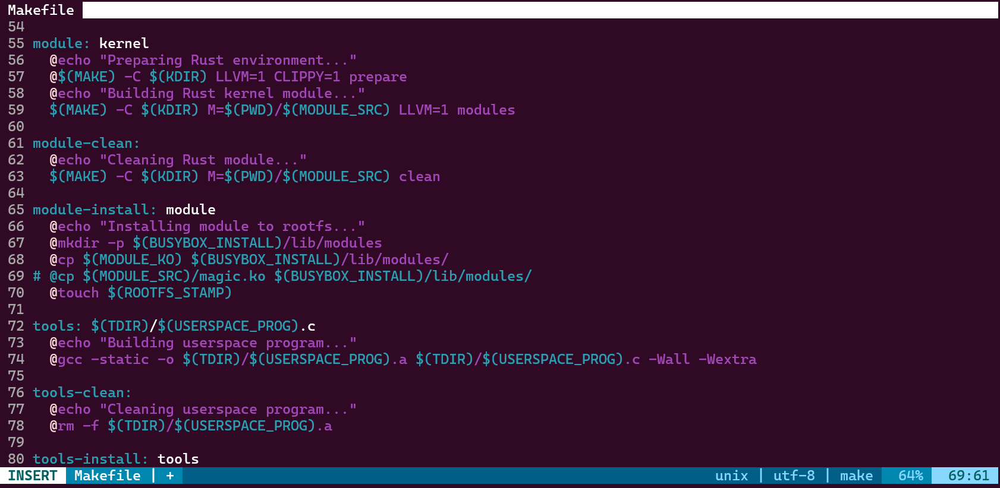
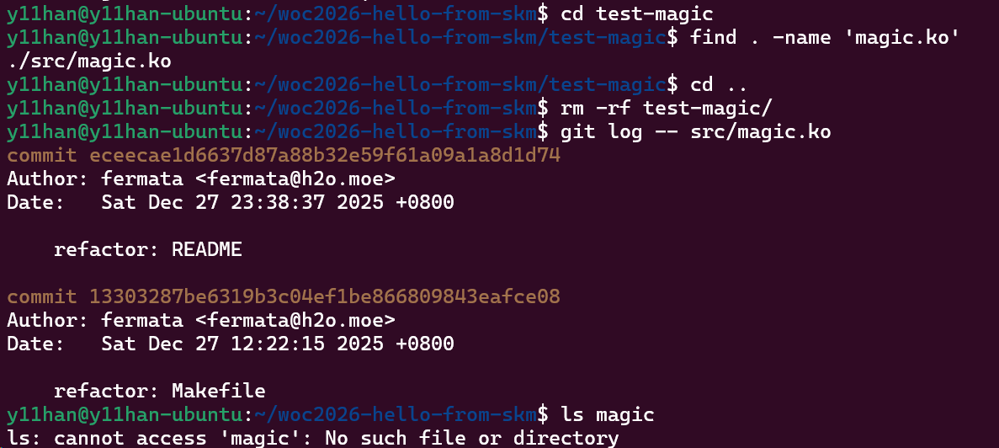
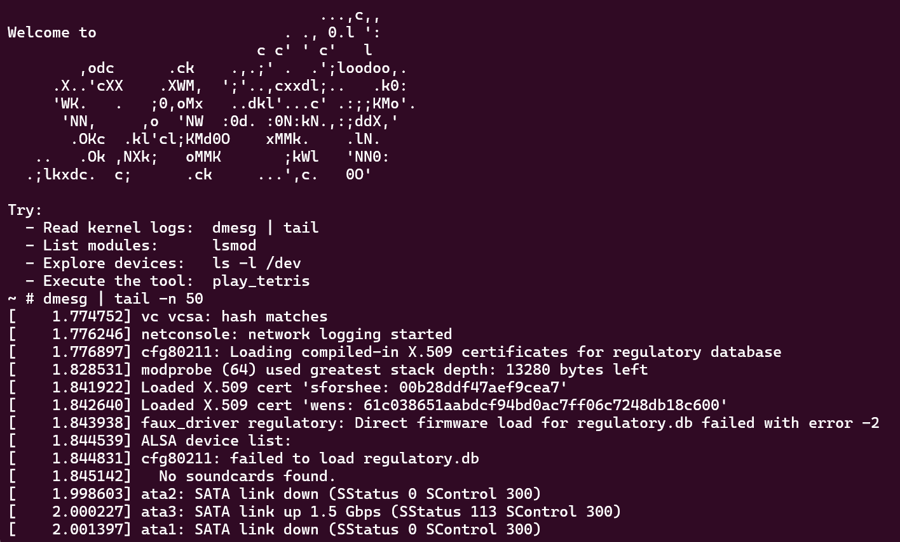
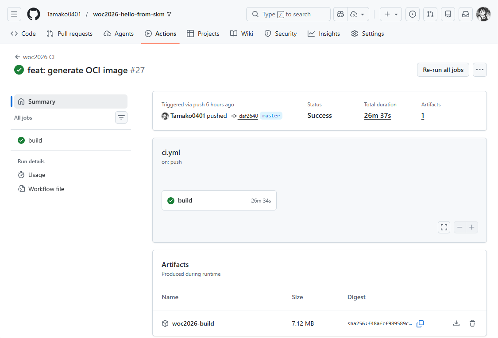
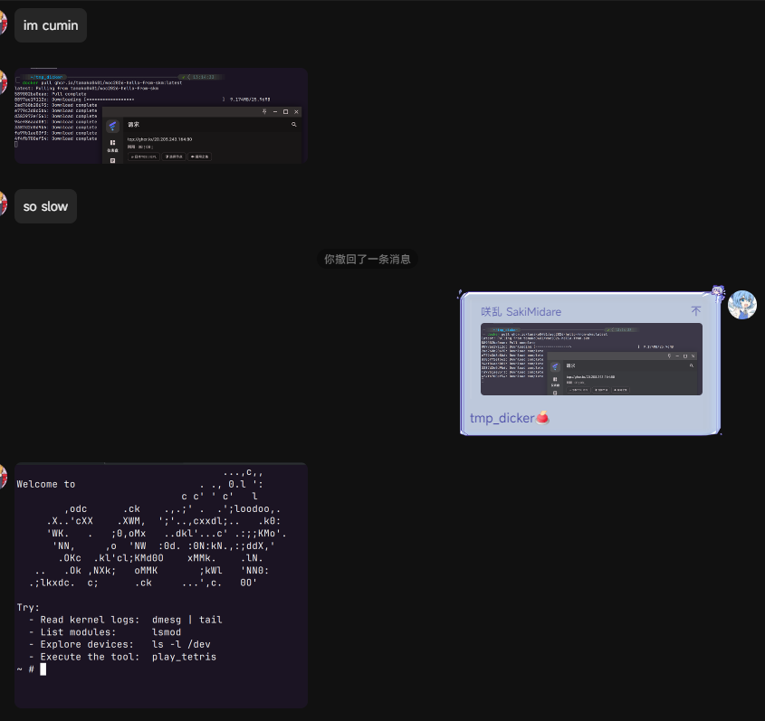

> 完成 [SAST Rust 内核模块](https://github.com/f3rmata/woc2026-hello-from-skm) 的编译和运行
>
> **[加分项] CI/CD**: 配置 GitHub Actions（或 GitLab CI），实现代码 Push 后自动构建 Docker 镜像并推送至镜像仓库 (Docker Hub / GHCR)
>
>  - [x] 任务 1：找到并修复 tetris 模块中的 panic
>
>  - [x] 任务 2：加载 magic.ko，用 ioctl 触发 flag  <=> Task 4
>
>  - [x] 任务 3：给这个仓库加上 CI/CD + 产出 OCI 镜像
>
>  - [x] 任务 4：给 tetris 模块加一个 debugfs 调试入口
>
> #### 你可以继续改进的地方（加分项）
>
> 这些不要求必须做，但很值得做：
> - [ ] 把 ioctl 命令号做成共享头文件/绑定，避免用户态和内核态各写各的魔数。
> - [x] 给 `scripts/run.sh` 加一个“无 KVM 的降级开关”。
> - [x] 做一个 `make test`：本地一键跑 QEMU smoke test。   ===本地没做，CI 做了 ===
> - [ ] 给仓库加上基本的格式化/静态检查入口（`rustfmt`/`clippy`/`clang-format`）。

**以下按完成顺序**  

> [!自动检测 KVM]
> 
>  
> 
> qemu64 纯软件模拟，如果没有 KVM 就不能用-cpu host  
> 
> 
> 

> [!busybox 官方仓库限制历史对象访问，已切换至 GitHub 镜像以保证可复现性]
> 
> 
> 

> 
> [!panic fix]
> 
> 
> 
> ``` sh
> $ make build
> ...   
> \*\*\* Rust bindings generator 'bindgen' versions 0.66.0 and 0.66.1 may not  
> \*\*\* work due to a bug (https://github.com/rust-lang/rust-bindgen/pull/2567),  
> \*\*\* unless patched (like Debian's).  
> \*\*\*   Your version:     0.66.1  
> \*\*\* Please see Documentation/rust/quick-start.rst for details  
> \*\*\* on how to set up the Rust support.  
> BINDGEN rust/bindings/bindings_generated.rs  
> BINDGEN rust/uapi/uapi_generated.rs  
> ...   
> ```
> 
> ``` sh
>  $ make run
> ...   
> panicked at 'called \`Result::unwrap() \` on an \` Err \` value: FromBytesWithNulError { kind: InteriorNul(4) }', /usr/share/cargo/registry/bindgen-0.66.1/codegen/mod.rs:717:71  
> make[3]: \*\*\* [rust/Makefile:464: rust/uapi/uapi_generated.rs] Error 101  
> make[3]: \*\*\* Deleting file 'rust/uapi/uapi_generated.rs'  
> make[3]: \*\*\* Waiting for unfinished jobs....  
> panicked at 'called \`Result::unwrap() \` on an \` Err \` value: FromBytesWithNulError { kind: InteriorNul(4) }', /usr/share/cargo/registry/bindgen-0.66.1/codegen/mod.rs:717:71  
> make[3]: \*\*\* [rust/Makefile:458: rust/bindings/bindings_generated.rs] Error 101  
> make[3]: \*\*\* Deleting file 'rust/bindings/bindings_generated.rs'  
> make[2]: \*\*\* [/home/y11han/woc2026-hello-from-skm/linux/Makefile:1320: prepare] Error 2  
> make[1]: \*\*\* [Makefile:248: \_\_sub-make] Error 2  
> make[1]: Leaving directory '/home/y11han/woc2026-hello-from-skm/linux'  
> make: \*\*\* [Makefile:31: linux/arch/x86_64/boot/bzImage] Error 1  
> ...   
> ```
> 
> 内核强制调用了 bindgen，无法通过绕开在本地跑 bindgen，那么就指定 bindgen 版本为 0.65.1  
> ```sh
> $ cargo install bindgen-cli --version 0.65.1
> ```
> ---
> ```sh
> $ ls src/*.ko
> src/woc2026_hello_from_skm.ko  
> ```
> 拷贝虚空文件是何意味
> 
> 
> 
> 发现滚木，不存在的 magic.ko，先注释掉了
> 

> [!加载magic.ko，用ioctl触发flag]  
> 上一步发现虚空拷贝 magic.ko 文件，`$ git status --ignored` 中有 deleted: src/magic.ko，说明 Task 2（magic ioctl）在当前仓库中已被移除。  
> magic 模块已被移除（或合并），  当前仓库中 flag 触发路径已迁移至现有模块（tetris 或其 ioctl）  
> 
> 
> ~~s3 说有问题先跳过~~  
> ~~别急后面有反转~~
> 

> [!加上CI/CD + 产出OCI镜像]  
> 
> 
> ```sh
>  docker pull ghcr.io/tamako0401/woc2026-hello-from-skm:latest
>  docker run -it --rm ghcr.io/tamako0401/woc2026-hello-from-skm:latest
> ```
>
> 
> oh it works
> 

> [!给 tetris 模块加一个 debugfs 调试入口]  
> 
> debugfs 目录：/sys/kernel/debug/tetris/  
> 只读文件：state  
> 内容包含：score / game_over / next_piece / current_piece / board(20x10 \#/ .)
>
> 实现要点：  
> debugfs 的 state 读取走的是 kernel::debugfs::Writer（seq_file 单次输出），只读稳定；  
> /dev/tetris 和 debugfs 观察的是同一份 TetrisDeviceInner（通过在注册 miscdevice 时把 Arc\<TetrisDeviceInner> 存到 this_device 的 drvdata，然后 open 时取回 clone），所以 debugfs 读到的状态是真实的实时状态；  
> 模块生命周期里持有 \_debugfs: TetrisDebugFs，RAII 方式卸载时会自动删 debugfs 文件/目录。
>
> 运行时：  
> 1.挂载 debugfs：  
> `mount -t debugfs none /sys/kernel/debug`  
> 2.插入模块后读状态：  
> `cat /sys/kernel/debug/tetris/state`  
> 3.同时用 /dev/tetris 操作，再读 debugfs：  
> `echo a > /dev/tetris（左移）`  
> `echo w > /dev/tetris（旋转）`  
> 然后再 `cat /sys/kernel/debug/tetris/state`  