完成 [SAST Rust 内核模块](https://github.com/f3rmata/woc2026-hello-from-skm) 的编译和运行
>
> **[加分项] CI/CD**: 配置 GitHub Actions（或 GitLab CI），实现代码 Push 后自动构建 Docker 镜像并推送至镜像仓库 (Docker Hub / GHCR)  
>  - [x] 任务 1：找到并修复 tetris 模块中的 panic  
>  - [x] 任务 2：加载 magic.ko，用 ioctl 触发 flag  <= Task 4  
>  - [x] 任务 3：给这个仓库加上 CI/CD + 产出 OCI 镜像  
>  - [x] 任务 4：给 tetris 模块加一个 debugfs 调试入口  
> #### 你可以继续改进的地方（加分项）  
> 这些不要求必须做，但很值得做：
> - [ ] 把 ioctl 命令号做成共享头文件/绑定，避免用户态和内核态各写各的魔数。
> - [x] 给 `scripts/run.sh` 加一个“无 KVM 的降级开关”。 
> - [x] 做一个 `make test`：本地一键跑 QEMU smoke test。   ===本地没做，CI 做了 ===  
> - [ ] 给仓库加上基本的格式化/静态检查入口（`rustfmt`/`clippy`/`clang-format`）。
  
**以下按完成顺序**  

## 自动检测 KVM
 
 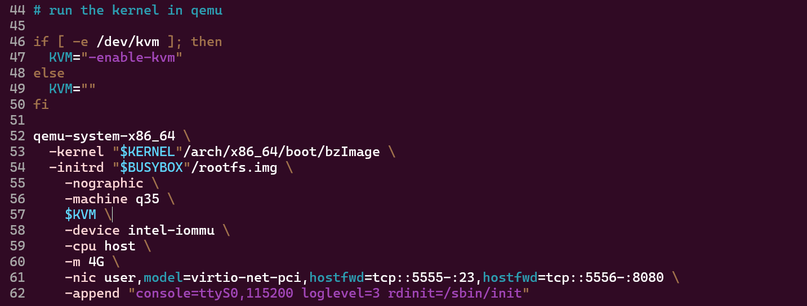 
 
 qemu64 纯软件模拟，如果没有 KVM 就不能用-cpu host  
 
 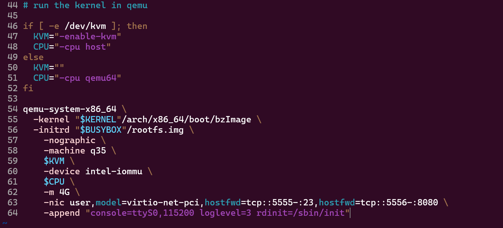
 

 [!busybox 官方仓库限制历史对象访问，已切换至 GitHub 镜像以保证可复现性]
 
 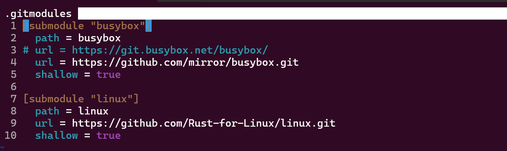
 

 
 ## panic fix
 
 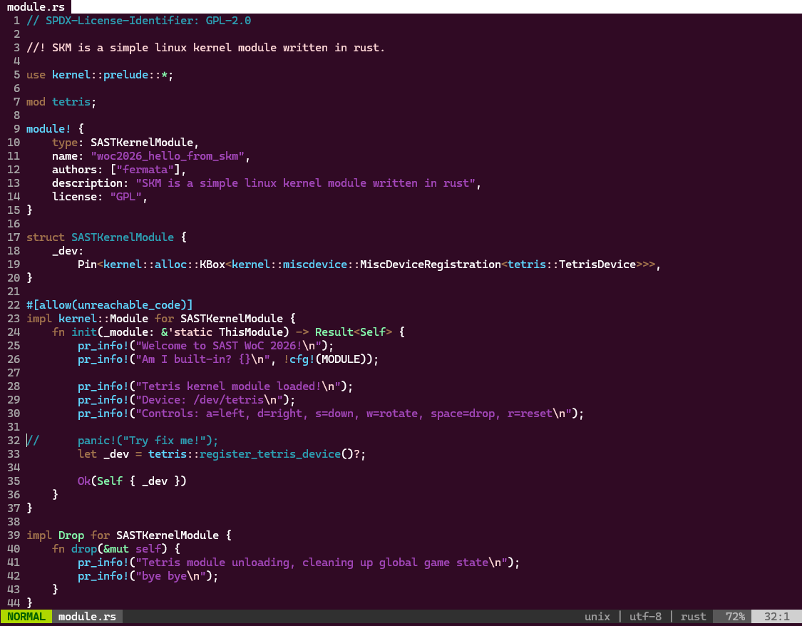
 
 ``` sh
 $ make build
 ...   
 \*\*\* Rust bindings generator 'bindgen' versions 0.66.0 and 0.66.1 may not  
 \*\*\* work due to a bug (https://github.com/rust-lang/rust-bindgen/pull/2567),  
 \*\*\* unless patched (like Debian's).  
 \*\*\*   Your version:     0.66.1  
 \*\*\* Please see Documentation/rust/quick-start.rst for details  
 \*\*\* on how to set up the Rust support.  
 BINDGEN rust/bindings/bindings_generated.rs  
 BINDGEN rust/uapi/uapi_generated.rs  
 ...   
 ```
 
 ``` sh
  $ make run
 ...   
 panicked at 'called \`Result::unwrap() \` on an \` Err \` value: FromBytesWithNulError { kind: InteriorNul(4) }', /usr/share/cargo/registry/bindgen-0.66.1/codegen/mod.rs:717:71  
 make[3]: \*\*\* [rust/Makefile:464: rust/uapi/uapi_generated.rs] Error 101  
 make[3]: \*\*\* Deleting file 'rust/uapi/uapi_generated.rs'  
 make[3]: \*\*\* Waiting for unfinished jobs....  
 panicked at 'called \`Result::unwrap() \` on an \` Err \` value: FromBytesWithNulError { kind: InteriorNul(4) }', /usr/share/cargo/registry/bindgen-0.66.1/codegen/mod.rs:717:71  
 make[3]: \*\*\* [rust/Makefile:458: rust/bindings/bindings_generated.rs] Error 101  
 make[3]: \*\*\* Deleting file 'rust/bindings/bindings_generated.rs'  
 make[2]: \*\*\* [/home/y11han/woc2026-hello-from-skm/linux/Makefile:1320: prepare] Error 2  
 make[1]: \*\*\* [Makefile:248: \_\_sub-make] Error 2  
 make[1]: Leaving directory '/home/y11han/woc2026-hello-from-skm/linux'  
 make: \*\*\* [Makefile:31: linux/arch/x86_64/boot/bzImage] Error 1  
 ...   
 ```
 
 内核强制调用了 bindgen，无法通过绕开在本地跑 bindgen，那么就指定 bindgen 版本为 0.65.1  
 ```sh
 $ cargo install bindgen-cli --version 0.65.1
 ```
 ---
 ```sh
 $ ls src/*.ko
 src/woc2026_hello_from_skm.ko  
 ```
 拷贝虚空文件是何意味
 
 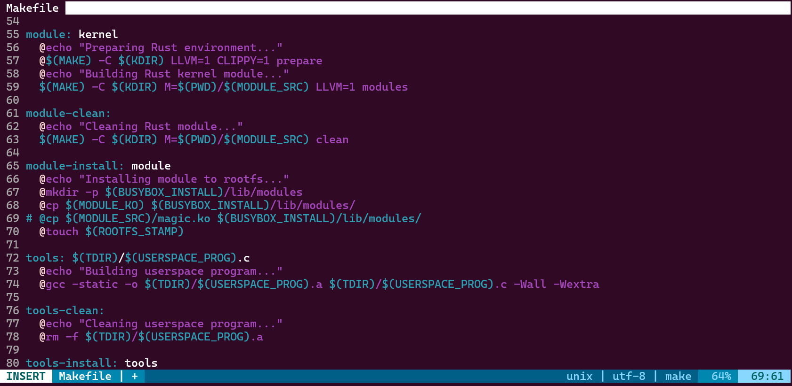
 
 发现滚木，不存在的 magic.ko，先注释掉了
 

 ## 加载magic.ko，用ioctl触发flag
 上一步发现虚空拷贝 magic.ko 文件，`$ git status --ignored` 中有 deleted: src/magic.ko，说明 Task 2（magic ioctl）在当前仓库中已被移除。  
 magic 模块已被移除（或合并），  当前仓库中 flag 触发路径已迁移至现有模块（tetris 或其 ioctl）  
 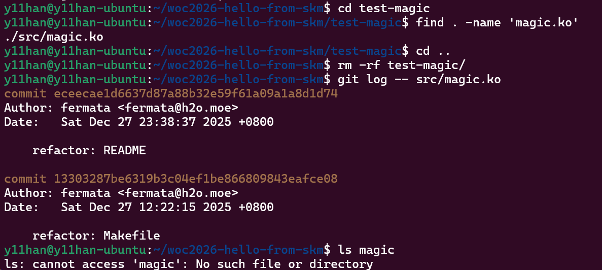

 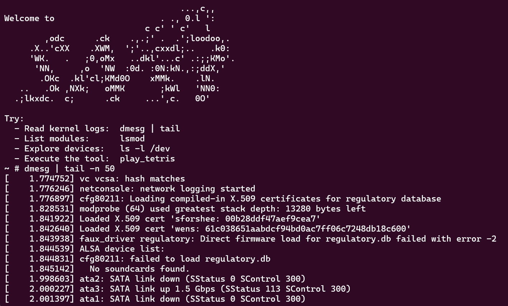
 ~~s3 说有问题先跳过~~  
 ~~别急后面有反转~~
 

## 加上CI/CD + 产出OCI镜像
 
 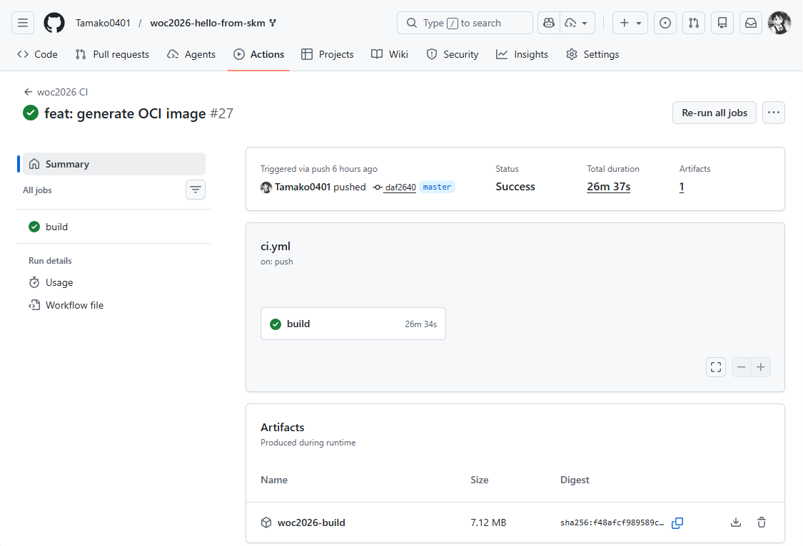
 ```sh
  docker pull ghcr.io/tamako0401/woc2026-hello-from-skm:latest
  docker run -it --rm ghcr.io/tamako0401/woc2026-hello-from-skm:latest
 ```

 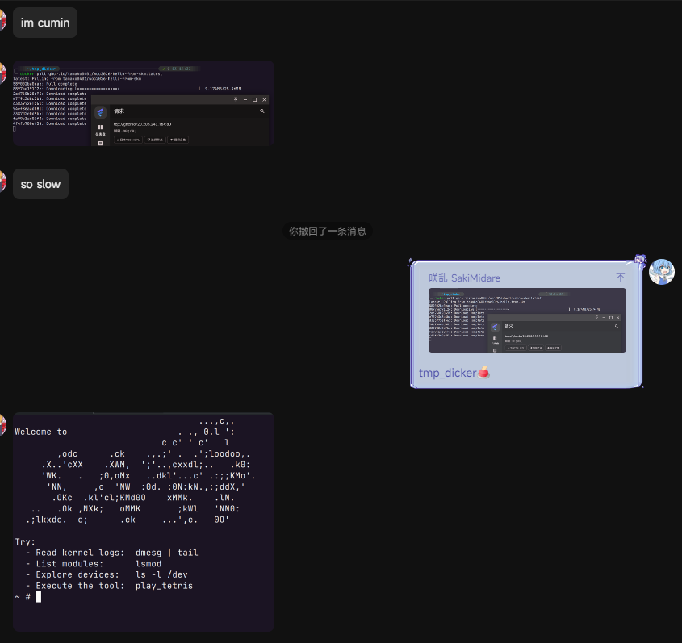
 oh it works

## Task 4
> `0001`在Task 2的内核放置了一个`dev1ce`作为小礼物  
> 并留下了一个暗号 : `0x1337`  
> 你能在dmesg里找到她留下的秘密吗?  
>请使用 `insmod /lib/modules/magic.ko`  

意外地发现：哎呀这不就是我们 Task2 的子任务 2 嘛  
~~纯黑盒又不是不能做~~，自己把 magic.ko cp 到 busybox/\_install/lib/modules/ 再重新打包

宿主机中 搓最小用户态，再 cp 进 rootfs
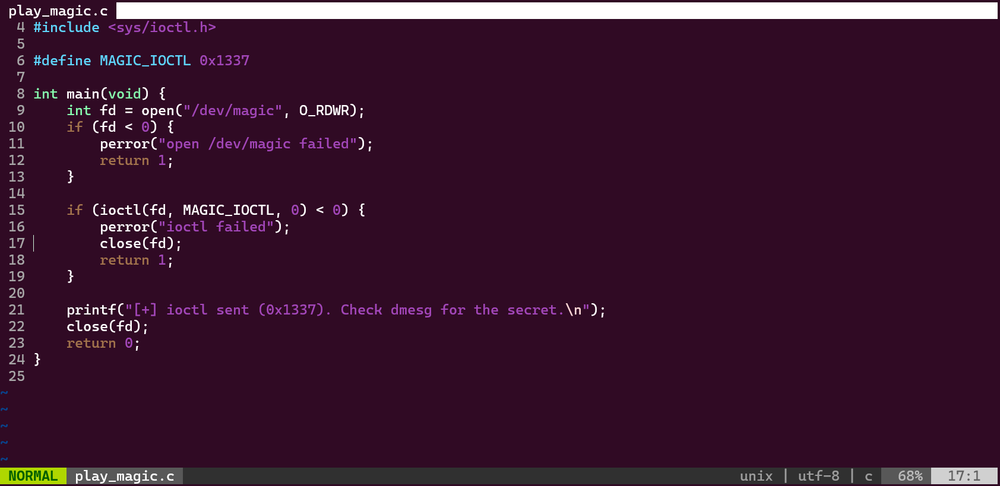

QEMU 中
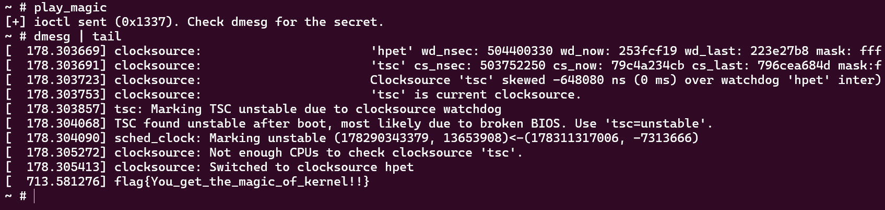

 >[!done]  
 flag{You_get_the_magic_of_kernel!!}
 
## Task 6
>此题是Task 2的附加题
>在[GitHub - f3rmata/woc2026-hello-from-skm](https://github.com/f3rmata/woc2026-hello-from-skm) 中使用DebugFS添加一个数据统计功能,并为仓库提交pr来进行验收


**Tetris DebugFS 调试接口（详细说明）**

> 位置：`/sys/kernel/debug/tetris/`
>
> 如未挂载 DebugFS：
>
> ```sh
> mount -t debugfs none /sys/kernel/debug
> ```

本模块在 DebugFS 下提供了一组“可观测性接口”，目标是：

- **实时观察** `tetris` 游戏内部状态（board / piece / score 等）；
- **统计** `/dev/tetris` 的 I/O 行为与游戏关键事件；
- 输出采用 **文本格式**（方便 `cat` / `grep` / `awk` / `python` 脚本处理）。

### 目录结构

插入模块后，目录下会出现以下文件：

- `state`：当前游戏状态快照（可读）
- `stats`：计数器与派生信息（可读，key=value）
- `stats_reset`：统计重置辅助入口（当前实现为只读提示文本；后续可扩展为写入触发重置）

---

### 1) `state`：游戏状态快照

路径：`/sys/kernel/debug/tetris/state`

用途：
- **调试/验收** 游戏逻辑是否按预期运行；
- 与 `/dev/tetris` 的渲染输出不同，`state` 更偏“结构化信息 + 原始棋盘”。

输出内容（示例字段）：
- `score: <u32>`：当前得分
- `game_over: <bool>`：是否已结束
- `next_piece: <TetrominoType>`：下一个方块类型
- `current_piece: type=<...> x=<...> y=<...> rotation=<...>`：当前活动方块（如存在）
- `board:`：随后打印 20 行，每行 10 列
    - `#` 表示该格已被占用
    - `.` 表示空格

示例：

```text
score: 300
game_over: false
next_piece: T
current_piece: type=I x=3 y=0 rotation=1
board:
..........
..........
....##....
....##....
...
```

说明：
- 该文件是“读取时现算现写”的快照。
- `state` 的实现会对游戏互斥锁做一次 `lock()`，以保证读取到一致的内部状态。

---

### 2) `stats`：数据统计与观测指标

路径：`/sys/kernel/debug/tetris/stats`

格式：
- **每行一个** `key=value`
- key 命名尽量稳定，便于脚本长期依赖

字段说明（当前实现）：

#### 时间
- `uptime_ns`：统计模块创建后到现在的时间（纳秒）

#### `/dev/tetris` 设备层统计
- `opens`：打开次数（`open(2)`）
- `reads`：读次数（`read(2)` / read_iter）
- `bytes_read`：累计读出的字节数
- `writes`：写次数（`write(2)` / write_iter）
- `bytes_written`：累计写入的字节数
- `ioctls`：ioctl 调用次数
- `invalid_ioctls`：非法 ioctl cmd 计数（返回 `-EINVAL` 的情况）
- `invalid_inputs`：写入字符不在支持集合中的次数

#### 游戏事件统计
- `resets`：重置次数（通过输入 `r/R` 或 ioctl reset）
- `pieces_spawned`：生成新方块次数
- `pieces_locked`：方块落地锁定次数
- `lines_cleared`：累计消行数
- `score_gained`：累计增加的分数（每次消行带来的增量总和）

#### 输入动作统计（尽量用于“成功率/手感”分析）
- `left` / `right` / `down` / `rotate` / `drop`：各动作尝试次数
- `left_ok` / `right_ok` / `down_ok` / `rotate_ok`：动作成功次数（例如左移没有撞墙/碰撞才算成功）

#### 关联当前状态（用于和上面计数器对齐 sanity check）
- `current_score`：此刻的 score
- `game_over`：此刻是否 game over

示例：

```text
uptime_ns=123456789
opens=1
reads=20
bytes_read=8192
writes=35
bytes_written=35
ioctls=0
invalid_ioctls=0
invalid_inputs=2
resets=1
pieces_spawned=10
pieces_locked=8
lines_cleared=3
score_gained=300
left=12
left_ok=9
right=10
right_ok=7
down=5
down_ok=5
rotate=8
rotate_ok=6
drop=3
current_score=300
game_over=false
```

实现与开销说明：
- 所有计数器均为 `AtomicU64`，热路径增量采用 `Relaxed`（尽量低开销）。
- 只有在读取 `stats` 时才会做格式化输出。

---

### 3) `stats_reset`：统计重置入口

路径：`/sys/kernel/debug/tetris/stats_reset`

当前语义：
- 读取会返回一行提示文本：`write any value to reset counters`
- 目前尚未实现“写入即重置”（后续可扩展为 write-only 控制文件）

建议用法（当前阶段）：
- 验收时可通过重载模块/重启来清空计数器；
- 或者在口述验收中说明后续将把 `stats_reset` 做成真正 write-to-reset。

---

### 操作流程

1) 挂载 debugfs：

```sh
mount -t debugfs none /sys/kernel/debug
```

2) 插入模块后查看状态：

```sh
cat /sys/kernel/debug/tetris/state
```

3) 玩一会儿再看统计：

```sh
cat /sys/kernel/debug/tetris/stats
```

4) 对照验证：
- `writes` 应与键盘输入次数大致一致（用 `echo a > /dev/tetris` 等）
- `left_ok <= left`、`rotate_ok <= rotate` 等应成立
- `lines_cleared` 增加时，`score_gained`/`current_score` 应同步变化

